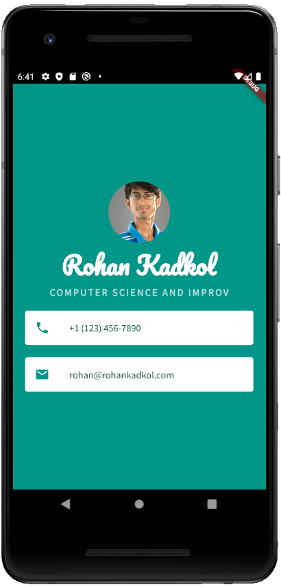

# Mi Card

This is a Flutter app I worked on following the starter code from the [Flutter Udemy course by Angela Yu](https://www.udemy.com/course/flutter-bootcamp-with-dart/).

This app is like a visiting card app. It just shows the details that my visiting card would usually show.

## Skills Learned

* CircleAvatar
* Custom fonts
* Material Icons
* Card and ListTile

## Screenshot

